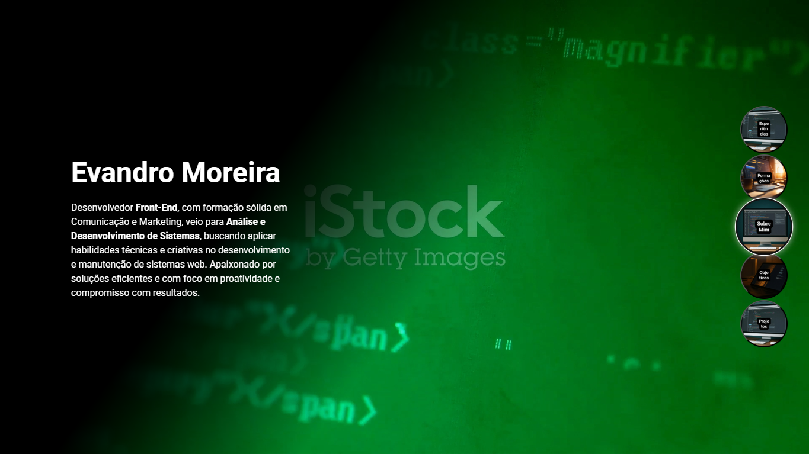
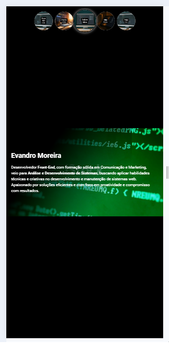

<h1>Site pessoal</h1>

Eu sou <b>Evandro Moreira</b>, programador <b>Front-End</b> em constante aprendizado e evolução.

Assim ficou o meu site pessoal. 

Atualmente estou <b>criando projetos</b> e <b>desenvolvendo habilidades</b> com:
 

        
 
 
<h3>Contatos:</h3>

 
<h3>Perspectiva:</h3>
<h5>Desktop - clique na imagem para ser direcionado ao site</h5>

<h5>Mobile - clique na imagem para ser direcionado ao site</h5>

